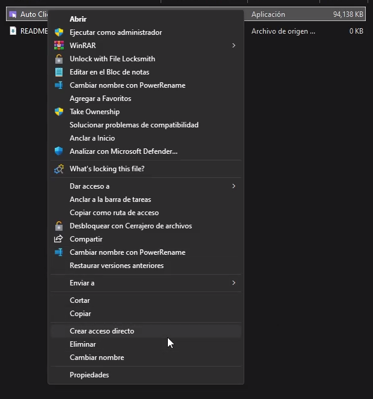
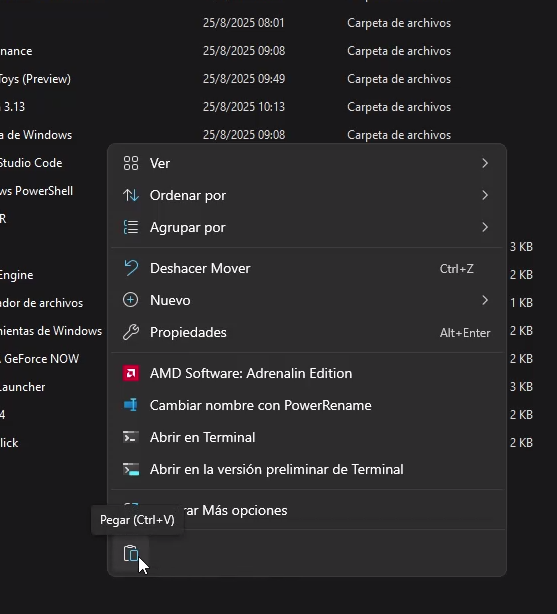
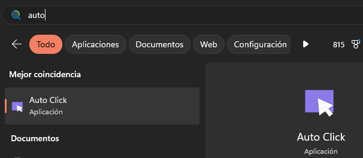

Para realizar este tutorial, sigue estos pasos:

1. Haz clic derecho sobre el progrma ``Auto Click.exe`` y selecciona **Crear acceso directo**.

    <!-- Captura: Crear acceso directo -->
    

    Si quieres cambiale el nombre del acceso directo a Auto Click para que se vea mejor.

2. Abre el explorador de archivos y navega a la siguiente carpeta:

     ```
     C:\Users\tu-usuario\AppData\Roaming\Microsoft\Windows\Start Menu\Programs
     ```

    <!-- Captura: Navegando a la carpeta -->
    

3. Pega el acceso directo en esa carpeta.

    <!-- Captura: Pegando el acceso directo -->
    

4. Presiona la tecla **Windows** y busca "Auto Click" para ejecutar el programa.

    <!-- Captura: Buscando Auto Click en el menú inicio -->
    

¡Listo! Ahora tendrás acceso rápido a Auto Click desde el menú de inicio.
